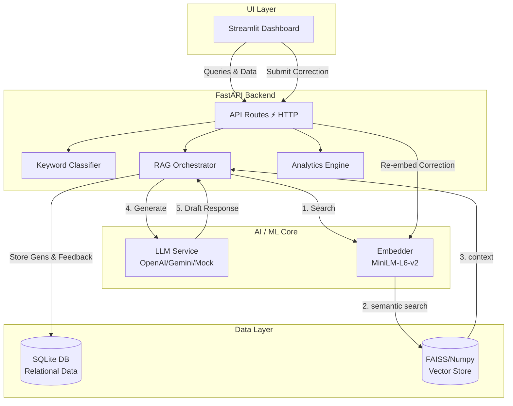

<div align="center">
  <h1>SupportCopilot AI</h1>
  <p><strong>A Production-Ready, Self-Learning Customer Support AI (RAG + End-to-End Feedback Loop)</strong></p>

  [](https://www.python.org/downloads/)
  [](https://fastapi.tiangolo.com)
  [](https://streamlit.io)
  [](https://opensource.org/licenses/MIT)
</div>

---

## Overview

**SupportCopilot AI** is a fully functional, end-to-end AI support agent designed to dramatically reduce ticket resolution times. It doesn't just retrieve canned answers; it uses **Retrieval-Augmented Generation (RAG)** to draft highly contextual responses based on your company's historical tickets and knowledge base.

Crucially, it features a **Self-Learning Feedback Loop**. When human agents correct the AI's suggestions, the system automatically re-embeds the correction into its vector database, ensuring it never makes the same mistake twice.

---

## Key Features

- **Advanced RAG Pipeline**: Ingests historical support tickets (CSV/JSON) and Knowledge Base articles (MD/TXT/PDF) using `sentence-transformers` for dense semantic search.
- **True Self-Learning Loop**: Agent corrections are captured, embedded, and prioritized in future retrievals via source-type boosting, allowing the system to learn in real-time.
- **Strict Grounding & Anti-Hallucination**: The response generator uses a strict cascade (Feedback → Tickets → Docs → Fallback) to ensure the AI only answers using available context.
- **Auto-Classification**: Automatically categorizes incoming queries (e.g., *Billing, Technical, General, Refund*).
- **Real-Time Analytics**: Built-in dashboard tracks total queries, ingestion counts, auto-resolution rates, accuracy, and average latency.
- **Multi-LLM Support**: Seamlessly switch between OpenAI (GPT-4o), Google Gemini, or a local/mock backend for zero-cost testing.
- **Streamlit UI**: A clean, interactive frontend for uploading data, chatting, and managing feedback.

---

## Architecture Design



---

## Quick Start Guide

### 1. Installation

Clone the repository and install the dependencies in a virtual environment:

```bash
git clone https://github.com/purvanshh/AI-Customer-Support-Copilot.git
cd AI-Customer-Support-Copilot

python3 -m venv .venv
source .venv/bin/activate

# Install core and optional dependencies (FAISS, sentence-transformers, pypdf)
pip install -r requirements.txt
pip install -r requirements-optional.txt
```

### 2. Configuration

Copy the example environment file and configure your API keys if you plan to use real LLMs. By default, the system uses the `sentence-transformers` embedding engine and a grounded fallback generator, so **no external API keys are required to run the demo!**

```bash
cp .env.example .env
```

### 3. Build the Initial Index

Load the provided demo tickets and documentation into the local SQLite database and Vector Store:

```bash
# Ingest the 10 included sample demo tickets & KB Markdown
python scripts/rebuild_index.py --docs demo_data/sample_kb.md
```

### 4. Run the Application

Start the FastAPI backend (Terminal 1):
```bash
uvicorn app.main:app --port 8000
```

Start the Streamlit frontend (Terminal 2):
```bash
streamlit run frontend/app.py
```

Open **[http://localhost:8501](http://localhost:8501)** in your browser!

---

## Docker Deployment

The project includes a complete Docker deployment setup for production environments.

```bash
# Build and run both the API and Streamlit UI containers
docker-compose up --build
```
*The API will be available at `http://localhost:8000` and the UI at `http://localhost:8501`.*

---

##  API Documentation

Once the backend is running, the interactive Swagger UI is available at `http://localhost:8000/docs`.

**Core Endpoints:**
- `POST /upload-tickets` — Ingest CSV/JSON historical support tickets.
- `POST /upload-docs` — Ingest Knowledge Base files (TXT/MD/PDF).
- `POST /query` — Retrieve relevant context and generate an AI response.
- `POST /feedback` — Submit agent approvals, rejections, or text corrections (triggers re-embedding).
- `GET /analytics` — Fetch real-time system metrics.

---

## 🛠️ The Self-Learning Feedback Loop

SupportCopilot AI is built to improve continuously:
1. **Query**: A customer asks *"I was charged twice."*
2. **Retrieval**: The system pulls the closest historical ticket.
3. **Draft**: The LLM drafts a response.
4. **Correction**: The human agent edits the draft to add standard apology phrasing and approves it.
5. **Re-Embedding**: The system catches the `POST /feedback` request, **embeds the corrected text**, and inserts it into the Vector database mapped as `source_type=feedback`.
6. **Learning Complete**: The next time a similar query arrives, the retriever explicitly boosts `feedback` scores, ensuring the system returns the human-corrected version instead of the raw historical ticket.

---

## Contact & Contributions

Designed and developed by **Purvansh Sahu**. 

If you find this project interesting or have suggestions for improvements, feel free to reach out or open an issue!

- **GitHub**: [@purvanshh](https://github.com/purvanshh)
- **Email**: purvanshhsahu@gmail.com
